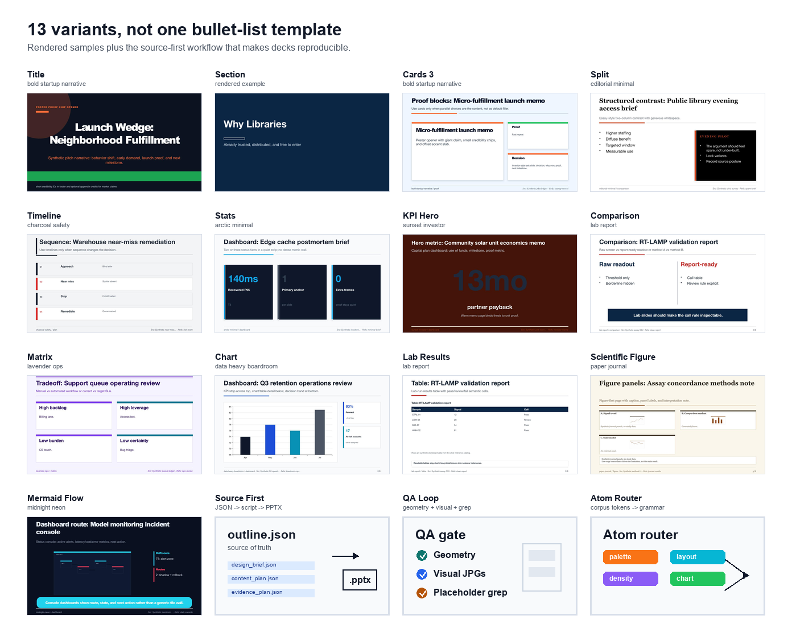
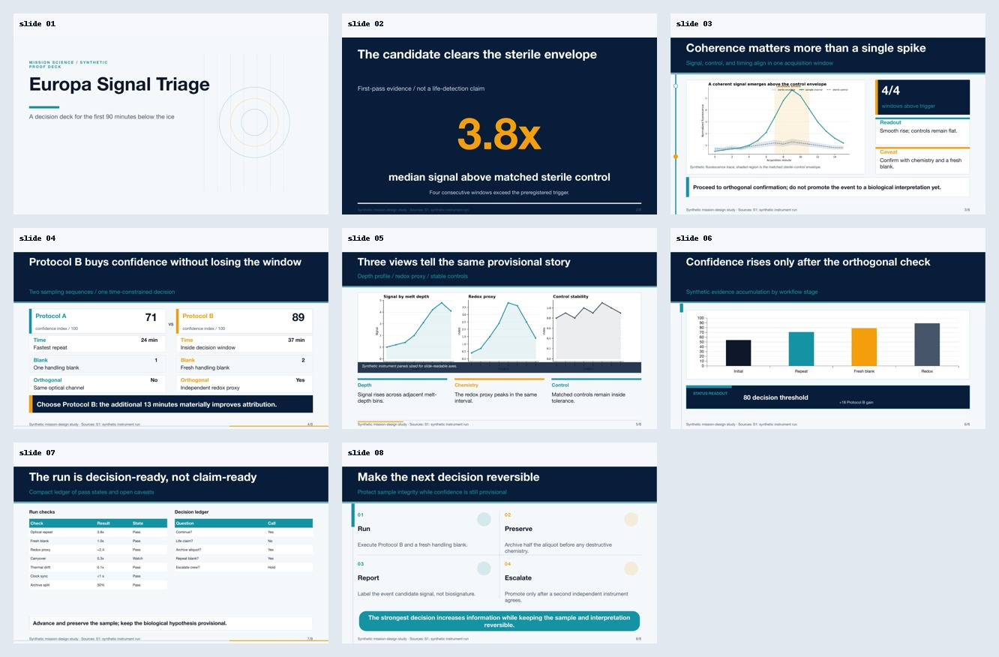
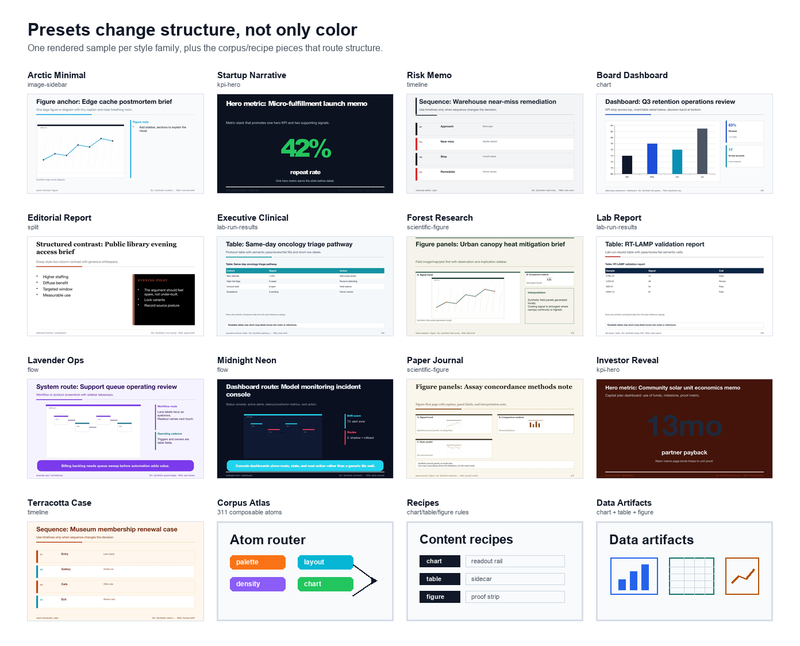

# presentation-skill

A skill for coding agents that produces editable PowerPoint decks from structured source files. The idea is to treat a deck like code: `outline.json` is the source, scripts build the `.pptx`, and a validation loop checks layout, density, and design-taste issues before delivery.

[](https://github.com/siril9/presentation-skill/releases)
[](LICENSE)
[](templates/pptxgenjs/README.md)



*Rendered samples across the renderer variants, from title and section slides to lab tables, figures, KPI, matrix, chart, comparison, and flow layouts.*

Ask an agent for a lab report, board memo, investor update, clinical dashboard, policy brief, or scientific figure deck. The skill writes source JSON, routes style and content structure, builds an editable `.pptx`, and runs QA instead of shipping a screenshot or a stack of centered bullets.

## Why

Most agent-built slide decks pass automated checks and still look bad. Dead whitespace, centered body text, the same three-card layout used five times in a row, generic stock-icon clusters. They feel like AI output even when the words are right.

This skill encodes deck design as constraints instead of vibes. A variant grammar restricts what a slide can be. A preset system fixes palette, typography, and density per style family. A descriptor-only corpus of public deck-like records gives the agent style context to pick from instead of inventing from scratch. A QA loop catches layout regressions before the deck ships.

## When to use this skill

Reach for it when an agent needs to:

- build a one-off PowerPoint `.pptx`, slide deck, or presentation from a single prompt (quick-deck mode, no workspace needed)
- generate a `.pptx` from a structured `outline.json`
- redesign, rebuild, or extend an existing slide deck
- run layout and design QA on a generated deck
- assemble a lab, clinical, board, investor, or editorial deck with consistent style
- maintain a reusable presentation workspace that can be re-rendered later

Quick-deck mode is the right path for one-shot 5-10 slide decks. Workspace mode is for decks that will be iterated, audited, or rebuilt later.

Skip it for text-only brainstorming where no deck artifact is needed, or for direct edits to a generated `.pptx` when its workspace source files are available (fix the source instead).

Skill name: `presentation-skill`. Aliases for fuzzy skill matching and search: `powerpoint-deck-builder`, `pptx-skill`, PowerPoint skill, PPTX skill, slide-deck generator, slides generator, deck builder, presentation generator, presentation maker, PowerPoint generator, agent presentation skill, Codex presentation skill, ChatGPT presentation skill.

## What's actually in the box

- **A pptxgenjs renderer with 13 slide variants.** `title`, `section`, `cards-3`, `split`, `timeline`, `stats`, `kpi-hero`, `comparison-2col`, `matrix`, `chart`, `lab-run-results`, `scientific-figure`, `flow` (Mermaid). Each variant has its own layout discipline so a deck doesn't collapse into bullet-list-after-bullet-list.
- **A preset system across 13 style families.** Lab report, executive clinical, board risk memo, investor reveal, editorial report, civic science policy, and so on. Each ships with palette, font pair, density profile, and treatment options.
- **A descriptor-only style corpus (~2,200 records) atomized into a LEGO token atlas.** The corpus carries described palettes, layouts, density patterns, and structural motifs from public deck-like sources (no copied assets). It's processed into 311 composable atoms across 12 atom types (palette, typography, layout_motif, chart_treatment, table_treatment, header_treatment, footer_treatment, decorative_motif, density, arc_beat, rhythm_signature, content_treatment). A composition router queries the atlas to mix and match atoms across families per topic, so decks pull grammar — not just colors — from the corpus.
- **A three-step QA loop.** Geometric checks (overflow, overlap, density), rendered-image visual inspection on JPGs, and a placeholder-text grep that catches leftover `TODO`/`lorem`/`xxx` strings. The visual-inspection prompt is biased toward finding problems, not confirming the deck looks fine.
- **Workspace mode for decks you'll rebuild later.** `design_brief.json`, `content_plan.json`, `evidence_plan.json`, `asset_plan.json`, `outline.json`, and `notes.md` live in a folder. Readiness diagnostics tell the agent what to fix next instead of re-running blind.

## See it



One source deck, seven content compositions: KPI hero, evidence mosaic, scorecard, figure atlas, native chart, lab ledger, and decision matrix. The page system changes with the content job instead of repeating one card grammar.

[](https://github.com/siril9/presentation-skill/releases/tag/v0.7.0)

The style board samples one rendered slide per preset family so the differences are visible as structure, not only palette.

[](https://github.com/siril9/presentation-skill/releases/tag/v0.7.0)

Full release notes and comparison images are in the [v0.7.0 release](https://github.com/siril9/presentation-skill/releases/tag/v0.7.0).

## Install

### Install as a Codex plugin

Add this repo as a Codex plugin marketplace, then open `/plugins` in Codex and install `presentation-skill` from the **Presentation Skill** marketplace:

```bash
codex plugin marketplace add siril9/presentation-skill --ref v0.8.0
```

For local development against a checkout:

```bash
codex plugin marketplace add /absolute/path/to/presentation-skill
```

The marketplace entry lives at `.agents/plugins/marketplace.json` and points to `plugins/presentation-skill`, which bundles a synced snapshot of the root skill.

### Install as a local skill

Clone or copy this repo into your Codex skills directory:

```bash
git clone https://github.com/siril9/presentation-skill \
  $CODEX_HOME/skills/presentation-skill
cd $CODEX_HOME/skills/presentation-skill
pip install python-pptx "markitdown[pptx]"
npm install
```

Core generation does not require LibreOffice. Render-based verification uses LibreOffice `soffice` and Poppler `pdftoppm` when available.

## Try It

Build and verify the bundled example:

```bash
node scripts/build_deck_pptxgenjs.js \
  --outline examples/outline.json \
  --output out.pptx \
  --style-preset executive-clinical
```

Then verify:

```bash
python3 scripts/qa_gate.py \
  --input out.pptx \
  --outdir /tmp/pptx-qa \
  --style-preset executive-clinical \
  --skip-render
```

For production builds, add `--strict-geometry --fail-on-design-warnings --fail-on-whitespace-warnings` and complete one manual visual review (which writes a `manual_review_passed.flag` into the outdir) before re-running.

For agents, the shortest useful prompt is:

> Use `presentation-skill` to build a 7-slide editable PowerPoint deck. Treat `outline.json` as source, choose a preset that fits the topic, use charts/tables/figures where they help, and run the QA gate before delivery.

## What people actually build with this

A few concrete use cases this skill is set up for, drawn from the variants and presets it ships with:

- **Lab and clinical data reports.** CSV in, scientific-figure slides with subfigure labels out. `lab-run-results` slides use semantic table coloring (red/green/yellow for pass/fail/status). `image-sidebar` for microscopy panels and workflow diagrams.
- **Investor and board decks.** `kpi-hero`, `stats`, and `comparison-2col` variants with the `bold-startup-narrative` or `data-heavy-boardroom` presets. Generated charts cropped, slide-sized, and readable before assembly.
- **Editorial and policy briefs.** `editorial-report` and `civic-science-policy` presets with `cards-3`, `matrix`, and `timeline` variants. Built for proof-burden + audience-posture decks rather than 10-bullet recap slides.
- **Design gallery testing.** Build the same outline across all 13 presets with multiple header variants to see how a content shape lands in different design families. Useful when you don't know which preset fits a topic.

## Feedback

The most useful feedback is a concrete deck-quality miss: repeated layout, crowded text, weak chart/table/figure use, unreadable type, awkward whitespace, or a style that did not match the topic. Use the [deck quality feedback template](.github/ISSUE_TEMPLATE/deck_quality_feedback.yml) and include the prompt, preset, contact sheet, or `outline.json` when possible.

## Workspaces

For decks you'll rebuild or extend later, use workspace mode:

```bash
python3 scripts/init_deck_workspace.py \
  --workspace decks/my-deck \
  --title "My Deck Title" \
  --style-preset executive-clinical

# edit outline.json + brief, then:
python3 scripts/build_workspace.py \
  --workspace decks/my-deck \
  --qa \
  --overwrite
```

Two scripts make workspaces self-driving:

- `report_workspace_readiness.py` — diagnoses what's wrong with the source files before you rebuild. Surfaces unbound artifacts, stale outlines, missing source recommendations, and ranks the next action.
- `advance_workspace.py --execute` — runs the next deterministic action (bind artifacts, scaffold data figures, apply contracts) or hands back an agent-facing source-edit prompt when the next move needs an outline change.

Full workspace docs in [`references/deck_workspace_mode.md`](references/deck_workspace_mode.md).

## Verification

`qa_gate.py` runs three classes of check:

1. **Geometric** — text overflow, element overlap, low-contrast text, narrow text boxes that force excessive wrapping, decorative lines positioned for single-line titles that wrapped to two, footer collisions, insufficient slide margins.
2. **Visual** (optional, requires render) — slides are exported to JPGs and inspected with a prompt biased toward finding problems. Catches things geometric checks miss (white-band issues on dark backgrounds, mermaid pile-ups, decorative elements bleeding into content).
3. **Content** — placeholder grep on the markitdown extract. Catches leftover `TODO`, `[insert ...]`, `xxx`, `lorem`, and template-stub strings.

A deck isn't declared ready until the geometric gate passes, the visual pass returns zero findings, and at least one fix-and-verify cycle has been run.

Run with `--skip-render` for fast iteration without LibreOffice; drop `--skip-render` for the full render-and-inspect pass.

## Project layout

```
presentation-skill/
├── SKILL.md                  # full skill spec for agents
├── agents/openai.yaml        # OpenAI-style agent prompt
├── scripts/                  # builders, QA, workspace tools
├── templates/pptxgenjs/      # variants + presets (JS renderer)
├── templates/python/         # python-pptx renderer (legacy + niche)
├── references/               # outline schema, planning schemas,
│                             # style corpus, design guidance
├── examples/outline.json     # minimum-viable outline example
└── decks/                    # release showcases and gallery decks
```

## Agent integration

Codex and other OpenAI-style agents trigger this skill for PowerPoint, `.pptx`, slide deck, presentation, deck editing, and layout-QA requests. The full agent contract lives in [`SKILL.md`](SKILL.md). Key rules:

- Source-first: write `outline.json` first, not inline `pptxgenjs` or `python-pptx` code.
- Fix the source files, never the `.pptx` artifact.
- Run QA before delivery. If QA fails, rebuild from source.

Discovery metadata for agents and shareable summaries for humans live in [`DISCOVERY.md`](DISCOVERY.md) and [`agents/discovery.json`](agents/discovery.json).
Copy-ready community posts and curation-request text live in [`docs/PROMOTION.md`](docs/PROMOTION.md).

## Releases

- [`v0.8.0`](https://github.com/siril9/presentation-skill/releases/tag/v0.8.0) — Codex plugin packaging, repo marketplace entry, synced plugin skill snapshot, and marketplace install docs.
- [`v0.7.0`](https://github.com/siril9/presentation-skill/releases/tag/v0.7.0) — optional first-class atom composition in the normal deck-start/design-contract/style-router workflow, plus README proof boards for renderer variants, style families, and Codex-native vs updated-skill comparison.
- [`v0.6.0`](https://github.com/siril9/presentation-skill/releases/tag/v0.6.0) — topic-aware atom router, stricter reproducible composition prompts, readable stats rendering, refreshed random-topic evidence gallery.
- [`v0.5.0`](https://github.com/siril9/presentation-skill/releases/tag/v0.5.0) — descriptor-only style corpus (~2,000 records), random-topic comparison gallery, design-catalog selector.
- [`v0.2.0`](https://github.com/siril9/presentation-skill/releases/tag/v0.2.0) — per-preset contact sheets, style-reference routing.
- [`v0.1.0`](https://github.com/siril9/presentation-skill/releases/tag/v0.1.0) — initial release with variant renderer + workspace mode.

## Further reading

- [`SKILL.md`](SKILL.md) — full agent contract and verification loop
- [`DISCOVERY.md`](DISCOVERY.md) — share kit, trigger phrases, proof links, and adoption checklist
- [`DESIGN.md`](DESIGN.md) — design philosophy and decisions
- [`ROADMAP.md`](ROADMAP.md) — open work and direction
- [`DEVELOPMENT.md`](DEVELOPMENT.md) — maintainer workflow

## License

MIT. See [`LICENSE`](LICENSE). Third-party dependencies keep their own licenses; no proprietary slide assets are bundled.

---

**Topics:** powerpoint, pptx, presentation, slide-deck, slides, deck-generator, presentation-generator, agent-skill, codex-skill, chatgpt-skill, openai-agents, pptxgenjs, python-pptx, deck-design, slide-qa, layout-validation, presentation-workspace, lab-report-deck, investor-deck, board-deck, scientific-figure-slides
